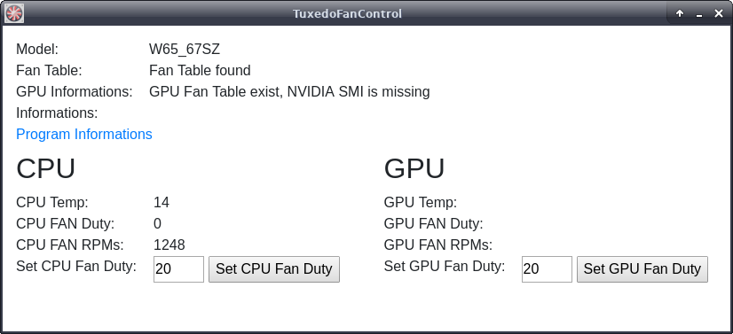

# WARNING - IMPORTANT
With this Program can you set manually the fan speed of your TUXEDO Notebook. You can destroy your Notebook, when you set a to low fan speed!

# Table of Content
<!-- TOC -->

- [WARNING - IMPORTANT](#warning---important)
- [Table of Content](#table-of-content)
- [Induction](#induction)
- [Dependencies](#dependencies)
- [UI](#ui)
- [Installation](#installation)
    - [Ubuntu](#ubuntu)
    - [Files and locations](#files-and-locations)
- [Daemon](#daemon)
    - [Systemd - Create Service File](#systemd---create-service-file)
    - [Systemd - Control the Daemon](#systemd---control-the-daemon)
- [Commandline Interface (CLI)](#commandline-interface-cli)
    - [Parameter](#parameter)
        - [-h / --help](#-h----help)
        - [-v / --version](#-v----version)
        - [--startdaemon](#--startdaemon)
        - [--stopdaemon](#--stopdaemon)
        - [--restartdaemon](#--restartdaemon)
        - [--statusdaemon](#--statusdaemon)
        - [--createunitfile](#--createunitfile)
        - [--removeunitfile](#--removeunitfile)

<!-- /TOC -->

# Induction
The TUXEDO Fan Control is a Application and Daemon for controlling the fans of CPU and GPU of your TUXEDO Notebook device.

# Dependencies
- NVIDIA SMI for Controlling the NVIDIA GPU Fan (Only need at devices with nvidia graphic cards)
- Xvfb (X Window Virtual Framebuffer)

# UI


The UI of the TUXEDO Fan Control show you the Stats of the CPU and GPU Fans.  
The Informations are
- Temperature
- Fan Duty in Percent
- Fan Speed in RPM

When the [Daemon](#daemon) is activ in the backgroud, you can not set the fan duty over the UI.

# Installation

## Ubuntu

apt install <path>/tuxedofancontrol_<VERSION>_amd64.deb
Example, the deb file, with the version 0.0.4, is located under the Download dir of the user "tux" 

```shell
apt install /home/tux/Downloads/tuxedofancontrol_0.0.4_amd64.deb
```

We recommend apt for the installation, because apt install the package [dependencies](#dependencies) of TUXEDO Fan Control.

## Files and locations

Installation dir: /opt/tuxedofancontrol/  
Log dir: /var/log/tuxedo-fan/

# Daemon
The TUXEDO Fan Control Daemon check every second the CPU and GPU temperature and set the fan duty, if need it.

## Systemd - Create Service File
Create the Service file under /etc/systemd/system/ with the Name "tuxedofancontrol.service"

```shell
[Unit]
Description=TUXEDO Fan Control

[Service]
Type=forking
ExecStart=/bin/bash -c "Xvfb :99 & export DISPLAY=:99 && <path>/tuxedofancontrol --startdaemon"
ExecStop=/bin/bash -c "Xvfb :99 & export DISPLAY=:99 && <path>/tuxedofancontrol --stopdaemon"
ExecReload=/bin/bash -c "Xvfb :99 & export DISPLAY=:99 && <path>/tuxedofancontrol --restartdaemon"

Restart=always

[Install]
WantedBy=multi-user.target
```

## Systemd - Control the Daemon

Enable
```shell
systemctl enable tuxedofancontrol
```

Disable
```shell
systemctl disable tuxedofancontrol
```

Start
```shell
systemctl start tuxedofancontrol
```

Stop
```shell
systemctl stop tuxedofancontrol
```

Restart
```shell
systemctl restart tuxedofancontrol
```

# Commandline Interface (CLI)

## Parameter

### -h / --help
Print all the Parameters and Descriptions

### -v / --version
Print the Version of TUXEDO Fan Control

### --startdaemon
Start the TUXEDO Fan Control Daemon

### --stopdaemon
Stop the TUXEDO Fan Control Daemon

### --restartdaemon
Restart the TUXEDO Fan Control Daemon

### --statusdaemon
Print the Status TUXEDO Fan Control Daemon

### --createunitfile
Create Unit File for Systemd

### --removeunitfile
Remove Unit File for Systemd
